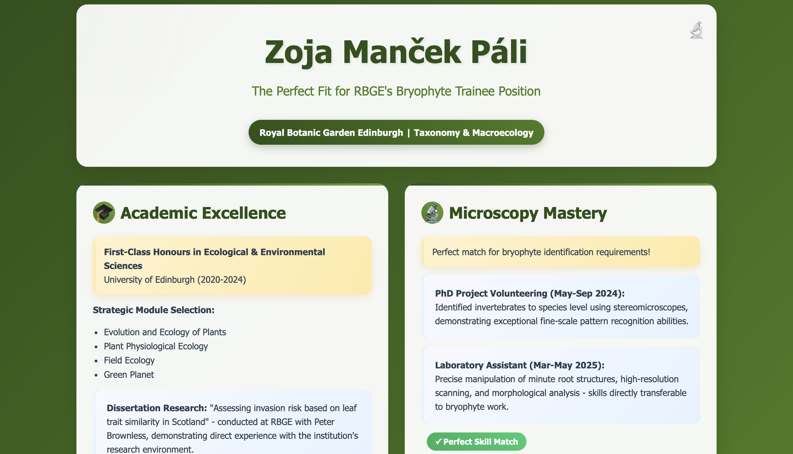

# RBGE Bryophyte Trainee Application - Zoja Manček Páli

## 🌿 [**VIEW LIVE WEBSITE →**](https://zmancekpali.github.io/RBGE-Application)

---

## Preview

---

## About This Application Portfolio

Interactive web portfolio showcasing qualifications for the Royal Botanic Garden Edinburgh Bryophyte Trainee position in Taxonomy and Macroecology.

**Candidate:** Zoja Manček Páli  
**Position:** Bryophyte Trainee - Taxonomy and Macroecology  
**Institution:** Royal Botanic Garden Edinburgh (RBGE)

## Key Qualifications Highlighted

- ✅ **First-Class Honours** in Ecological & Environmental Sciences (University of Edinburgh)
- ✅ **Direct RBGE Experience** through dissertation collaboration with Peter Brownless  
- ✅ **Advanced Microscopy Skills** demonstrated through species-level invertebrate identification
- ✅ **Scottish Fieldwork Expertise** in remote and mountainous terrain
- ✅ **Proven Research Capabilities** with published dissertation on invasive plant species
- ✅ **Technical Proficiency** in data analysis, laboratory techniques, and scientific communication

## 🔗 Quick Links

- **[View Live Website](https://zmancekpali.github.io/RBGE-Application)**
- **[CV](CV Zoja Manček Páli | RBGE Bryophyte Trainee.pdf)**
- **[Covering Letter](Zoja Manček Páli | RBGE Bryophyte Trainee.pdf)**
- **Email:** mancekpalizoja@gmail.com
- **Phone:** +44 7785 108549
- **Location:** Edinburgh, Scotland
- **[Linkedin](https://www.linkedin.com/in/zoja-manček-páli-7ab0581b4/)** 

---

*"Ready to contribute to RBGE's world-leading bryophyte research from day one!"*
